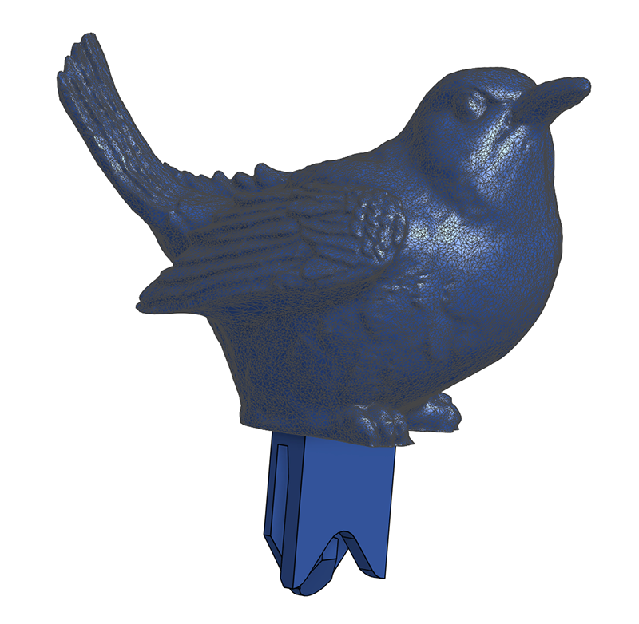
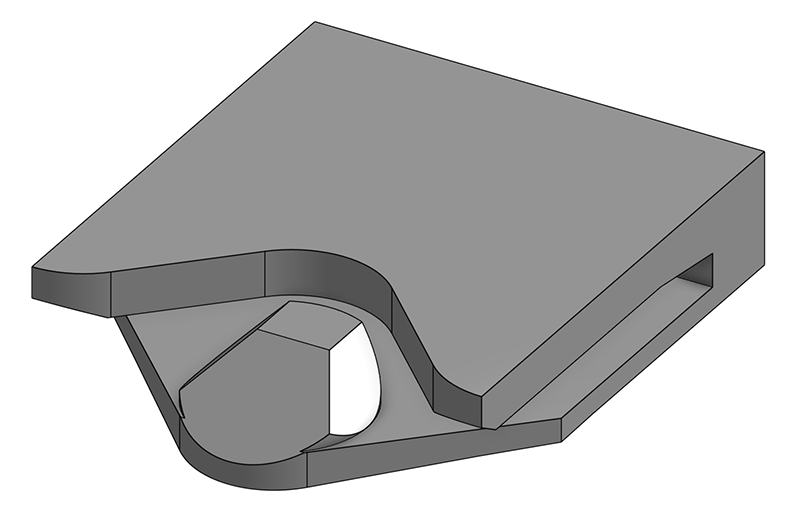

# Clip-Os
Clip-Os (which also respond to "clippos") are modular 3D-printed couplers which secure sheet stock to itself and other things. Clip-Os are incredibly fun and useful! Use them to quickly fabricate enclosures, build simple robot chasses, attach electronics to garmets, prototype complex faceted shapes, iterate flexural mechanisms, or simply sketch in three dimensions using hand tools and cheap materials. If you have a 3D printer and a pile of filament, consider queueing up a few plates of Clip-Os today! 

## Clip-O Library
|Clip-O|Image|Notes|*.stl|
|-|-|-|-|
|90_moreflexy||The first Clip-O to print! Relaxes to 90&deg;, but allows +/- 30&deg; of flexure. Great for building irregular polyhedra.|[90_moreflexy](fab/clip-o_90_moreflexy.stl)|
|180_moreflexy||Relaxes to 180&deg;, but allows +/- 30&deg; of flexure. Useful when you start breaking 90_moreflexy Clip-Os.|[180_moreflexy](fab/clip-o_180_moreflexy.stl)|
|ribbon||Accepts a loop of 1/2" ribbon or a bunch of loops of thread, for attaching Clip-Os to garmets!|[ribbon](fab/clip-o_ribbon.stl)|
|shaft_support||Supports a 9 mm dowel, or provides a great universal attachment loop for rope or yarn.|[shaft-support](fab/clip-o_shaft-support.stl)|
|bird||Bird Clip-O (bird from pmoews, available [here](https://www.thingiverse.com/thing:579484))|[bird](fab/clip-o_bird.stl)|
|switch||Holds a small limit switch (CIT Relay and Switch p/n DM3CQF1002L03). Great for making button boxes and robot bump sensors.|[switch](fab/clip-o_switch.stl)|
|micro:bit||Holds a BBC micro:bit board.|[micro:bit](fab/clip-o_microbit.stl)|
|half||The canonical Clip-O joint; start here to create new Clip-Os.|[half](fab/clip-o_half.stl)|

### Community-developed Clip-Os!
None yet. But this is where I'll link to your designs, if they don't end up in the library above!

## Tools and Materials
First, fabricate a bunch of Clip-Os! The *.stl files are in the rightmost column in the library above; start with the 90_moreflexy model. Nearly any FDM 3D printer equipped with normal PLA will work, but you should have a system tuned well enough to not need raft or brim for adhesion. A smudge with a glue stick (or better, the 3D printer bed adhesion helper that comes in a little wiper bottle) goes a long way. Slice the Clip-Os on their sides so the 90-degree parts look like an 'L' when viewed from above, at 100% infill, with no supports (unless needed for a weird Clip-O; standard joint Clip-Os, like 90_moreflexys, don't need them). Even if a few let go during fabrication, you should end up with a bunch of good parts in short order. 

In addition to a handful of Clip-Os, you'll need a pile of 1/16" (1.6 mm) sheet stock to form the bulk of your structures. I pick up free matboard offcuts from frame shops; it's a great material because the price is right (framers only need the outer edge of material!), it can be recycled, it cuts well with a razor and with a laser cutter, and there are tons of colors and finishes available. Plenty of other materials are also excellent: thin plywood; circuit boards; acrylic sheet; normal corrugated cardboard; thin HDPE; and likely a few hundred other options we haven't yet discovered.

You'll also need cutting tools for the sheet stock! A laser cutter is useful but optional; even if you have one, Clip-Os really shine when you design and iterate using hand tools. A good razor or box cutter is essential, along with a long safety ruler. You will also want a hole punch that can get through relatively thick material at the right depth. I've found that the 1/4" Crop-A-Dial Power Punch from We R Memory Keepers is ideal, not only for matboard but also for plastic, wood, and FR1/4. The punch is around $20 and includes a coarse depth adjustment, but you'll want to hand-fit a precise depth stop which you can fabricate using a few scraps of matboard. 
## Build!
Punch or laser-cut a hole with its center 1/2" (12.7 mm) in from the edge of 1/16" (1.6 mm) sheet stock. Now, slide a Clip-O onto the sheet until the round peg clicks into place. To remove the Clip-O, gently pull the peg back with your finger nail and slide the Clip-O off the sheet. That's it!
## History
Clip-Os attempt to address a long-standing frustration: how to quickly build structures using flat plates without getting lost in the minutiae of joinery design and time-consuming manual fabrication. The first Clip-O iteration was designed and fabricated as part of a residency guest program at Haystack Mountain School of Crafts in early 2024; you can read more about that work [here](https://www.notion.so/haystack-mtn/Haystack-Winter-Meal-Annunciator-feat-Clip-Os-19527fd8cab6461aad1b7a18058bb621). The Clip-Os shared here improve on the originals in two important ways: they eliminate the need for support material while printing (which saves a few minutes per Clip-O), and they change to a circular hole to allow for manual construction with the appropriate hole punch. Since then, Clip-Os have proven to be useful both as a prototyping and as a teaching tool. 
## License
This project is released under the terms of the Creative Commons Attribution-ShareAlike 4.0 International license, the full text of which you can find [here](https://creativecommons.org/licenses/by-sa/4.0/). Briefly, you are free to:
* **Share**: copy and redistribute the material in any medium or format for any purpose, even commercially.
* **Adapt**: remix, transform, and build upon the material for any purpose, even commercially.

... under the following terms:
* **Attribution**: You must give appropriate credit, provide a link to the license, and indicate if changes were made. You may do so in any reasonable manner, but not in any way that suggests the licensor endorses you or your use.
* **ShareAlike**: If you remix, transform, or build upon the material, you must distribute your contributions under the same license as the original.

In other words: print Clip-Os, use Clip-Os, modify Clip-Os, create Clip-Os, and sell Clip-Os, but only do so (a) under the same license, and (b) with attribution to this project.
## Contributing
If you have an idea for a new Clip-O, I encourage you to model-print-test-share! If you feel the result is promising, post an issue and we can discuss including it on this project page; I plan to carefully curate a limited set of parts on this repo, but will happily link to your page if your design doesn't fit.

I currently design Clip-Os in Onshape. I'd prefer use free software; suffice it to say that I have, and for now Onshape hits the right mix of convenience, capability, and iteration speed. The master design document is linked [here](https://cad.onshape.com/documents/f8566b5063ed2bec2c0bf098/w/9383563f0483cdef436c5f96/e/8b90506c768a93a411447b84?renderMode=0&uiState=6659e4c4520fe01cd50df649). Start by copying that document into your own workspace. In Part Studio 1, the part called 'clip-o_half' is the canonical joint that forms the basis for all Clip-Os. When you are ready to develop your own Clip-O, duplicate that part and then modify the copy as needed, usually by mirroring the joint or by adding ex-Clip-O interfaces. 
### Design Guidelines
The core Clip-O joint is designed for easy printability on commodity FDM 3D printers. That means it can be printed on its edge without support material, so the overhangs are all 45 degrees or less. The joints must be consistent between designs so that laser cut or manually punched sheet goods of the correct thickness always fit. You can ensure this by always starting your design by copying the clip-o_half part, as described above.

Beyond the core joint, try to design around avoiding support material when possible for ease of printing. Sometimes, like in the case with the Bird Clip-O and some circuit board Clip-Os, this isn't possible. Clip-Os that connect multiple bits of sheet material should do so with a 1/2" (12.7 mm) gap. Keep the release tabs on the same side so that users can keep them on the outside of assembled structures for quick disassembly. 
### Road Map
These are the next Clip-Os I hope to design, fabricate, test, iterate, and release here, not listed in any particular order. Of course, part of the magic and fun of the original Clip-O project was creating insanely specific Clip-Os which fit the application perfectly and had minimal use otherwise. At some point, it might make sense to split the library into "common" and "weird" Clip-Os, since not everyone needs 168.23&deg; angles in their projects.

Feel free to help chip away at this list if you like; no guarantees on inclusion in this library, but I'll credit and link to your work regardless. 
|Clip-O|Notes|
|-|-|
|rigid angle|... for those times one doesn't desire floppy angles. Likely 45&deg;, 90&deg;, 135&deg;, and 180&deg; for building boxy structures, plus perhaps dihedral angles from the Platonic solids: 70.53&deg;, 109.47&deg;, 116.57&deg;, and 138.19&deg;. And maybe 54.74&deg;, for the lovers of rapidly-spinning tiny tubes.|
|lattice joint|... for building plate lattices of various sorts. Probably a cross Clip-O without rotational symmetry for cubic lattices, and a slightly fancier version for building cubeoctahedral structures.|
|better flexures|... for building performant flexural mechanisms, like Saurus linkages and linear stages. Probably a blade flexure of some kind, likely pushing past the 12.7 mm gap guideline. Maybe a few versions with different resting angles.|
|gear motor mount|... for connecting integrated gear motor / wheel assemblies to the bottom of Clip-O robots. I've had my eye on the [Servo City Mini Econ Gear Motors](https://www.servocity.com/127-rpm-mini-econ-gear-motor/) for awhile so I'll probably start there, but may also produce versions for other generic gear motors available online. I'll want to test rigidity here; it's likely that this becomes two orthogonal Clip-Os, or maybe a front and rear Clip-O, or something else to distribute the motor weight across a few joints.|
|servo motor mount|... starting with the ubiquitous 9g blue servos used in so many fun small projects. This will need to include a Clip-O for the horn, and maybe a few forms optimized for various use cases, like robot arms and continuous rotation devices.|
|stepper motor mount|... for machine-building and stepper-y tasks, probably starting with NEMA17 frames, maybe in a few orientations.|
|automation/motion components|... for mounting things like 608 skate bearings, linear rails, and the like.|
|pivot wheel|... for building turtle robots. Maybe something with a snap-in ball.|
|free wheel|... for other times you want a freely rotating wheel.|
|bright light|... for attaching bright LEDs to things. maybe includes its own power?|
|thicker materials|... for 3 mm stock, or maybe even thicker material. Since this breaks Clip-O joint compatibility, it might require an additional layer of categorization. Also, big *big* Clip-Os, for building furniture out of plywood. Why not??|
|more switches|... for different switch types, and different switch orientations. Maybe one for a standard Cherry keyswitch, maybe one that also holds a robot whisker, maybe one for an arcade button, etc.|
|more PCBs|... for circuit boards large and small, particularly for sensor breakouts and LED pixels. Parameterize!|
|modular block set adapter|... for adapting to the quite popular plastic modular block system that seems to be all the rage! We come in peace, let us build together!|
|more fabric interfaces|... for wider ribbon, for other textile connection modalities. Snaps? Buttons? Zippers? Pivots?|
|power sharing|... experiments with copper tape for sending electrical signals between Clip-O joints! Ah, rabbit holes...|
|speaker|... a Clip-O to hold a li'l speaker, perhaps with a built-in amplifier.|
|tripod mount|... a Clip-O with a 1/4-20 insert. Or maybe a bolt, so it can attach to cameras.|
|lens|... for building cameras, spectrometers, etc. Add gaffer tape to gaps around flexy Clip-Os for bellows!|

&copy; *copyright zach fredin, 2024*
